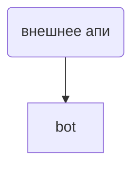

формат данных .bb

json настройка по токену  

```json 
{ 
openai_token:"", 
comment:"other_token"
}
```

sec_pass = \*\*ridge_security


//bots 

/ping - проверка состяния бота 

/request запрос к GPT 


Логика работы бота 





## Описание админки

- Пуш уведомления 
- Управление пользователями (вкл/выкл премиума)
- Выпуск промокодов 
- Выдать доступ к медитациям 
- 


Контроль за разработкой 
Построение маркетинговой стратегии 
Контроль за стабильностью версий 
Решение вопросов с аппстором 
Технический грамматный человек

- 


### Мониторинг задач 

- [ ] Сбор заявки с freelance.ru #taskMonitor
- [ ] Сбор заявки с FL.ru #taskMonitor
- [ ] Сбор заявки с Яндекс услуги #taskMonitor
- [ ]  Бот для заявок #taskMonitor
- [ ] Сбор заявки с Kwork #taskMonitor
- [ ] Бот для отправки в тг бот #taskMonitor 
- [ ] Единая база данных заявок с уникальным ID #taskMonitor 

Игра на f